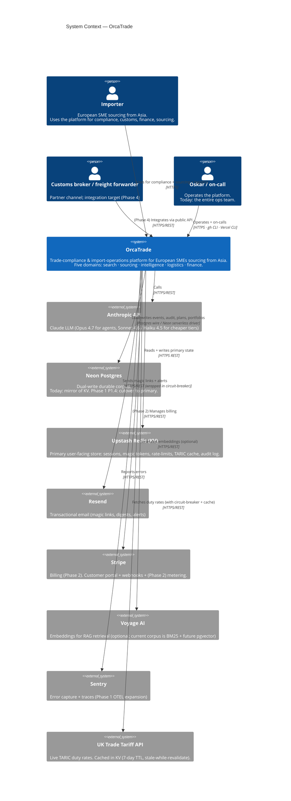

# L1 — System Context

OrcaTrade as one system in its environment. **Customers + 8 external
systems.**

## What this diagram is the answer to

> "What does OrcaTrade actually depend on at runtime?"

Eight external systems. Each is a sub-processor recorded in
[docs/handbook/security.md](../handbook/security.md). Each is a single
point of failure for the surface it serves; see the corresponding
runbook under [docs/runbooks/](../runbooks/) for the operational
response.

## Caveats not visible in the diagram

- **Vercel itself** is not shown — it's the substrate that runs
  OrcaTrade, not a system OrcaTrade integrates with. It would appear in
  a deployment diagram (out of scope per [README.md](README.md) §Out of
  scope).
- **The marketing-shell + app-shell Next.js applications** are part of
  OrcaTrade at this zoom level — they appear as separate boxes at L2.
- **GitHub (CI, CodeQL, gitleaks, dependabot, release-please)** is also
  not shown — it's the engineering substrate, not a runtime
  dependency.
- **Sub-processors marked (Phase X)** in
  [security.md](../handbook/security.md) (Stripe, Voyage) are shown
  here because the integration intent + the env-var slots already exist
  even if the production traffic doesn't yet.

## What's next (L2)

[02-container.md](02-container.md) opens the OrcaTrade box and shows
the major technical building blocks inside.
