# L2 — Container

The major technical building blocks inside OrcaTrade.

```mermaid
C4Container
    title Containers — OrcaTrade

    Person(importer, "Importer", "European SME importer")
    Person(internal, "Oskar / on-call", "Operator")

    System_Boundary(orcatrade, "OrcaTrade") {
        Container(marketing, "marketing-shell", "Next.js 15 App Router", "Editorial homepage at /<br/>+ 658 SEO-localised guides (EN/PL/DE).<br/>Future: lands at Vercel preview per branch.")
        Container(static, "Static HTML surface", "Hand-authored HTML + small JS", "744 pages: /start/ wizard,<br/>/intelligence, /sourcing, /finance, /process,<br/>/pricing, /agents, /platform, /press, /partners.<br/>Migrating into Next.js shells incrementally.")
        Container(appshell, "app-shell", "Next.js 15 App Router", "Authenticated product UI at /app/*.<br/>Today: dashboard only.<br/>Phase 2: plans, portfolios, drafts, audit-log viewer, admin team UI.")
        Container(dispatcher, "API dispatcher", "Single Vercel function: api/[...path].js", "Routes ~50 endpoints to lib/handlers/*.js.<br/>Single function due to Vercel Hobby 12-fn cap.<br/>Wraps every external call in lib/circuit.js (Phase 0 P0.3 migration).")
        Container(handlers, "Handlers + agents", "CommonJS modules in lib/handlers/", "Request handlers + 5 agent tool-use loops:<br/>compliance · logistics · sourcing · finance · orchestrator")
        Container(ai, "AI layer", "lib/ai/", "Model registry, prompt registry,<br/>cost telemetry, eval scorer, model-runtime")
        Container(intelligence, "Calculator layer", "lib/intelligence/", "Deterministic math:<br/>customs · routing · finance · CBAM · EUDR · REACH · CE · TARIC.<br/>NO LLM imports — enforced by test/import-boundary.test.js")
        ContainerDb(kv, "KV store helpers", "lib/intelligence/kv-store.js + runtime-store.js", "Primary user-facing state.<br/>Sessions, magic tokens, rate-limits, TARIC cache, circuit state, events stream.")
        ContainerDb(pg, "Postgres client + schema runner", "lib/db/client.js + scripts/db-migrate.js", "Dual-write target.<br/>schema.sql is content-hashed; schema_versions tracks applied migrations.")
        Container(cron, "Cron handler", "lib/handlers/cron.js + .github/workflows/cron.yml", "Nightly: TARIC warm cache · digest emails · monitoring alerts · compliance deadline reminders")
    }

    System_Ext(anthropic, "Anthropic API", "Claude LLM")
    System_Ext(neon, "Neon Postgres", "Serverless Postgres")
    System_Ext(upstash, "Upstash Redis", "KV store")
    System_Ext(resend, "Resend", "Transactional email")
    System_Ext(stripe, "Stripe", "Billing (Phase 2)")
    System_Ext(taric, "UK Trade Tariff API", "Live duty rates")
    System_Ext(sentry, "Sentry", "Error capture")

    Rel(importer, marketing, "Browses + reads", "HTTPS")
    Rel(importer, static, "Uses the /start/ wizard, reads guides", "HTTPS")
    Rel(importer, appshell, "Operates saved plans + portfolios (auth)", "HTTPS")
    Rel(internal, dispatcher, "Operates via API + Vercel CLI", "HTTPS · CLI")

    Rel(marketing, dispatcher, "Calls /api/* for dynamic content", "HTTPS/REST")
    Rel(appshell, dispatcher, "Calls /api/* for all auth + product", "HTTPS/REST")
    Rel(static, dispatcher, "Calls /api/start, /api/check, /api/quick-check, /api/auth/*", "HTTPS/REST")

    Rel(dispatcher, handlers, "Routes by URL slug to one of ~50 handlers", "Node require()")
    Rel(handlers, ai, "Uses MODELS registry + prompts + model-runtime", "Node require()")
    Rel(handlers, intelligence, "Calls calculators for every customer-visible number", "Node require()")
    Rel(handlers, kv, "Reads + writes primary state", "Node require() → HTTPS")
    Rel(handlers, pg, "Dual-writes (best-effort mirror)", "Node require() → Postgres wire")

    Rel(ai, anthropic, "All Anthropic API calls funnel through here", "HTTPS/REST")
    Rel(kv, upstash, "REST API to KV", "HTTPS")
    Rel(pg, neon, "Serverless Postgres connection", "Neon serverless driver")
    Rel(handlers, resend, "Magic links + alerts (circuit-wrapped)", "HTTPS/REST")
    Rel(handlers, stripe, "(Phase 2) Checkout + webhooks", "HTTPS/REST")
    Rel(intelligence, taric, "Live duty rates (circuit-wrapped + cached in KV)", "HTTPS/REST")
    Rel(handlers, sentry, "Error capture (lib/sentry.js)", "HTTPS/REST")

    Rel(cron, kv, "Warms TARIC cache, computes drift", "Node require() → HTTPS")
    Rel(cron, resend, "Sends digests + deadline reminders", "HTTPS/REST")

    UpdateLayoutConfig($c4ShapeInRow="3", $c4BoundaryInRow="1")
```

## What this diagram is the answer to

> "What runs where, and what talks to what inside OrcaTrade?"

Three big shapes to notice:

1. **One Vercel function, 50+ endpoints.** Driven by the Vercel Hobby
   12-function cap (per CLAUDE.md "Backend stack constraints"). The
   apex plan (Pillar IV/F5) and Phase 1 P1.10 plan to migrate to
   multi-function via `vercel.ts` once the constraint relaxes.
2. **KV-primary / PG-mirror.** PG is dual-write today; the apex plan
   promotes PG to primary for plans/portfolios/events in Phase 1 P1.4.
   Until then, KV is the load-bearing store for user-facing state.
3. **The intelligence layer never imports the AI layer.** Enforced by
   [test/import-boundary.test.js](../../test/import-boundary.test.js)
   (per [ADR 0003](../adr/0003-anthropic-sdk-boundary.md)). The
   calculators are deterministic; the LLM only wraps prose around
   pre-computed numbers (per [ADR 0002](../adr/0002-llm-never-produces-decision-numbers.md)).

## Caveats not visible in the diagram

- **The dispatcher single-function constraint** is shown but its
  blast-radius implication (one slow handler can starve the function
  pool) is not. Phase 1 P1.10 addresses this.
- **Three sub-projects** — root static site, marketing-shell,
  app-shell — share `/api/*` but have separate Next.js / build setups.
- **Cron is shown as a container** but it's actually two GitHub
  Actions cron schedules pointing at HTTP cron endpoints — the
  separation is logical, not physical.

## What's next (L3)

- [03-component-ai-layer.md](03-component-ai-layer.md) — inside the
  AI layer container
- [03-component-data-layer.md](03-component-data-layer.md) — inside
  the KV + PG containers, including the dual-write story + the
  audit-chain story + the 7-tables-written-but-undefined gap from the
  2026-05-30 audit
