# L3 — Components of the AI layer

What's inside `lib/ai/` + how the 5 agents in `lib/handlers/` use it.

```mermaid
C4Component
    title Components — AI layer

    Container_Boundary(handlers, "Handlers (lib/handlers/)") {
        Component(agent, "compliance agent", "lib/handlers/agent.js", "Tool-use loop. CBAM / EUDR / REACH / CE / customs queries.")
        Component(orchestrator, "orchestrator", "lib/handlers/orchestrator.js", "Meta-agent. Merges 33 tools across specialisms + delegation. Plans delegation.")
        Component(finance, "finance agent", "lib/handlers/finance-agent.js", "FX, working capital, TCO, payment terms")
        Component(logistics, "logistics agent", "lib/handlers/logistics-agent.js", "Routing, mode, warehouse hub, landed cost")
        Component(sourcing, "sourcing agent", "lib/handlers/sourcing-agent.js", "Supplier discovery, lane, country risk")
    }

    Container_Boundary(ai, "AI layer (lib/ai/)") {
        Component(models, "model registry", "lib/ai/models.js", "MODELS.AGENT (Opus 4.7) / TRIAGE (Haiku 4.5) / BULK (Sonnet 4.6).<br/>Enforced by test/model-registry-enforcement.test.js.<br/>First @ts-check file (PR #13).")
        Component(prompts, "prompt registry", "lib/ai/prompts/registry.js + */v1.txt", "One immutable prompt file per agent per version. Loaded lazily, cached in-memory.")
        Component(runtime, "model-runtime", "lib/ai/model-runtime.js", "Timeout + retry primitive. requestAnthropicMessage() + streamAnthropicMessage(). Was in lib/intelligence/; moved here in PR #8 to honour ADR 0003.")
        Component(cost, "cost telemetry", "lib/ai/cost-telemetry.js", "Per-call USD cost + token usage. Persisted to lib/log.js + events stream. Per-tenant cap is Phase 1 P1.7.")
        Component(eval, "eval scorer", "lib/ai/evals/scorer.js + */cases.v1.json", "Offline regex/heuristic scorer. Live nightly eval via scripts/agent-eval.js + .github/workflows/evals.yml.")
        Component(embeddings, "embeddings", "lib/ai/embeddings.js", "Voyage AI wrapper. Generates vectors for RAG. Optional (BM25 fallback).")
    }

    Container_Boundary(intel, "Calculator layer (lib/intelligence/)") {
        Component(calculators, "Quote calculators", "*-quote.js", "Deterministic math.<br/>NO LLM imports — enforced.<br/>Every customer-visible number originates here.")
        Component(rag, "RAG retrieval", "retrieval.js + rag-index.js + rag-store.js", "BM25 + pgvector hybrid. Returns chunk-id citations.")
        Component(corpus, "Corpus files", "corpus/*.json", "Hand-curated regulation summaries (CBAM, EUDR, REACH, CE).<br/>Phase 1 P1.11: full text, not summaries.")
    }

    System_Ext(anthropic, "Anthropic API", "Claude LLM")
    System_Ext(voyage, "Voyage AI", "Embeddings")

    Rel(agent, prompts, "Loads", "require()")
    Rel(agent, models, "Reads MODELS.AGENT", "require()")
    Rel(agent, runtime, "Sends messages via", "require()")
    Rel(agent, cost, "Reports usage", "require()")
    Rel(agent, calculators, "Calls as tools", "require()")
    Rel(agent, rag, "Retrieves citations as tools", "require()")

    Rel(orchestrator, prompts, "", "")
    Rel(orchestrator, models, "", "")
    Rel(orchestrator, runtime, "", "")
    Rel(orchestrator, calculators, "Calls many calculators", "require()")
    Rel(orchestrator, agent, "(Phase 2+) Delegates to specialists", "require()")

    Rel(finance, calculators, "Calls finance-quote.js + fx-quote.js", "require()")
    Rel(logistics, calculators, "Calls routing-quote.js + warehouse-quote.js + customs-quote.js", "require()")
    Rel(sourcing, calculators, "Calls sourcing-quote.js + factory-risk.js", "require()")

    Rel(runtime, anthropic, "POST /v1/messages (raw fetch, circuit-wrap pending P0.3)", "HTTPS/REST")
    Rel(eval, runtime, "Live eval runs through the same primitive", "require()")
    Rel(embeddings, voyage, "POST /v1/embeddings", "HTTPS/REST")
    Rel(rag, embeddings, "Optional — when VOYAGE_API_KEY set", "require()")

    UpdateLayoutConfig($c4ShapeInRow="3", $c4BoundaryInRow="1")
```

## What this diagram is the answer to

> "How does the AI layer actually work, and how does it stay on the
> right side of [ADR 0002](../adr/0002-llm-never-produces-decision-numbers.md)
> + [ADR 0003](../adr/0003-anthropic-sdk-boundary.md)?"

Three shapes to notice:

1. **All Anthropic traffic funnels through `lib/ai/model-runtime.js`.**
   That's the single LLM-call site (excluding the dispatcher's
   per-agent raw fetches that the runtime is replacing). Centralising
   here is what makes the [test/import-boundary.test.js](../../test/import-boundary.test.js)
   rule enforceable.
2. **The calculator layer never appears as a downstream of `lib/ai/`.**
   Arrows point handlers → calculators, never AI layer → calculators
   in the dependency direction. The LLM gets calculator output via
   the handler that called both; it never invokes a calculator
   itself.
3. **The eval scorer + the live eval harness share the runtime.**
   Eval results reflect production behaviour, not a synthetic stub.

## What's not in the diagram

- **The agent tool-use loop's iteration cap + the cost-spike risk** —
  see [docs/runbooks/ai-agent-failure.md](../runbooks/ai-agent-failure.md)
  for the operational response.
- **Prompt versioning policy** — prompts are immutable per version;
  bumping a prompt means committing `v2.txt` alongside `v1.txt`, never
  editing the v1 in place. Captured in [ADR 0009](../adr/0009-conventional-commits-release-please.md)
  + the prompt registry's design.
- **`orchestrator-personal.js`** — a customer-data-aware variant of
  the orchestrator; not in the diagram because it shares the same
  shape as `orchestrator.js` modulo a different prompt + a few tools.

## The two known gaps the diagram makes visible

- **Per-tenant cost cap missing** (`cost` component logs but doesn't
  enforce; runaway loops billed to whoever triggered them). Phase 1
  P1.7 closes this.
- **RAG corpus is summaries, not full text** (`corpus` component is a
  hand-curated subset). Phase 1 P1.11 closes this; sometime in Phase 1
  the diagram's `corpus` annotation updates.
