# L3 — Components of the data layer

KV-primary, PG-mirror today. Plus the audit-chain story + the
schema-runner story + the **gap the 2026-05-30 audit found**.

```mermaid
C4Component
    title Components — Data layer

    Container_Boundary(handlers, "Handlers (lib/handlers/)") {
        Component(mutationHandlers, "Mutation handlers", "lib/handlers/{plans,portfolio,account,orgs,scim}.js", "Saves, updates, deletes.<br/>Must write audit before returning success (ADR 0005).<br/>Currently swallow on failure — Phase 0 P0.4 closes.")
        Component(readHandlers, "Read handlers", "lib/handlers/*.js read paths", "Customer-facing reads. Pre-P1.4: KV-primary. Post-P1.4: PG-primary, KV as cache.")
    }

    Container_Boundary(kv, "KV store (lib/intelligence/)") {
        Component(kvStore, "kv-store", "lib/intelligence/kv-store.js", "Upstash REST wrapper. get/set/del/incr/expire.")
        Component(runtimeStore, "runtime-store", "lib/intelligence/runtime-store.js", "Higher-level helpers: rate-limit counters, evidence-bundle persistence, shared cache.")
        Component(cacheStore, "cache-store", "lib/intelligence/cache-store.js", "Hash-keyed cache helper used by quick-check, compliance-report etc.")
    }

    Container_Boundary(pg, "Postgres + schema runner") {
        Component(pgClient, "Postgres client", "lib/db/client.js", "Neon serverless-driver wrapper. Tagged template SQL.")
        Component(schemaRunner, "Schema migration runner", "scripts/db-migrate.js", "Content-hashes every migration, tracks in schema_versions table. Drift detection on hash mismatch.")
        Component(schema, "Schema definition", "lib/db/schema.sql", "Single-file schema today. Tables: users, organisations, memberships, saved_plans, saved_portfolios, actuals, audit_log, events, prompt_runs, subscriptions, schema_versions.")
    }

    Container_Boundary(audit, "Audit + provenance") {
        Component(eventsModule, "events module", "lib/events.js", "Dual-write event sink. KV array (5000-cap) + PG events table (best-effort).<br/>Per ADR 0005: must succeed before mutation returns 200 (P0.4 enforces).")
        Component(auditChain, "audit-chain", "lib/audit-chain.js", "Hash-chained audit log export.<br/>Today: export-time integrity only.<br/>Phase 1 P1.2: write-time per-row hash + daily root publication.")
        Component(hashHelper, "hash helper", "lib/hash.js", "Email pseudonymisation.<br/>Today: unsalted SHA-256 truncated to 16-hex (operational, NOT privacy-preserving).<br/>Phase 1 P1.3: HMAC-SHA-256 with EMAIL_PSEUDO_SALT.")
        Component(snapshotStore, "snapshot-store", "lib/snapshot-store.js", "Reproducibility snapshots (FX + AD/CVD + CBAM).<br/>TARIC pinning is Phase 1 P1.1 — currently NOT pinned.")
    }

    Container_Boundary(missing, "GAP: written but undefined in schema.sql") {
        Component(missingTables, "7 tables", "various lib/* stores", "agent_memory · monitoring_alerts · drafts · corpus_chunks · sanctions_entries · sanctions_refresh · data_snapshots<br/>Phase 0 P0.2 closes (schema-002-missing-tables.sql).")
    }

    System_Ext(upstash, "Upstash Redis", "Primary KV")
    System_Ext(neon, "Neon Postgres", "Dual-write target → Phase 1 P1.4 primary")

    Rel(mutationHandlers, eventsModule, "Records mutation event", "require()")
    Rel(mutationHandlers, runtimeStore, "Saves the actual record (KV-primary)", "require()")
    Rel(mutationHandlers, pgClient, "Dual-write mirror (best-effort)", "require()")

    Rel(readHandlers, runtimeStore, "Reads from KV", "require()")
    Rel(readHandlers, pgClient, "Reads from PG (Phase 1 P1.4 cutover)", "require()")

    Rel(eventsModule, kvStore, "Append to events:* keys (capped at 5000)", "require()")
    Rel(eventsModule, pgClient, "INSERT INTO events (best-effort)", "require()")
    Rel(eventsModule, hashHelper, "Pseudonymises email before persist", "require()")

    Rel(auditChain, eventsModule, "Reads events for export", "require()")

    Rel(snapshotStore, pgClient, "Persists FX + AD/CVD snapshots", "require()")
    Rel(missingTables, pgClient, "Writes happen but tables don't exist — silent failure", "require()")

    Rel(kvStore, upstash, "HTTPS REST", "HTTPS")
    Rel(runtimeStore, kvStore, "Wraps", "require()")
    Rel(cacheStore, kvStore, "Wraps", "require()")
    Rel(pgClient, neon, "Neon serverless driver", "Postgres wire")
    Rel(schemaRunner, pgClient, "Applies migrations", "require()")
    Rel(schemaRunner, schema, "Reads migration files", "fs.readFile")

    UpdateLayoutConfig($c4ShapeInRow="3", $c4BoundaryInRow="1")
```

## What this diagram is the answer to

> "Where does customer data actually live, what gets dual-written, and
> what are the known gaps?"

Three shapes to notice:

1. **Dual-write is best-effort today.** The PG arm fails silently per
   [ADR 0005](../adr/0005-audit-log-before-success.md)'s "current
   state" acknowledgement. Phase 0 P0.4 makes the audit write
   non-swallowed (refuse 2xx if audit fails). Phase 1 P1.4 cuts reads
   to PG-primary, making PG load-bearing.
2. **The audit chain is verifiable-export, not write-time tamper-evident.**
   See [ADR 0011](../adr/0011-security-scanning-stack.md)'s related
   work + Phase 1 P1.2 for the write-time hash + daily-root plan.
3. **The "GAP" box is the 2026-05-30 audit's biggest finding.** Seven
   PG tables are written to by store helpers but not defined in
   `schema.sql`. Writes have been failing silently (per
   [docs/runbooks/pg-outage.md](../runbooks/pg-outage.md) step 5's
   "half-applied migration" recovery procedure). Phase 0 P0.2 closes
   this with `schema-002-missing-tables.sql` + a writer-vs-schema
   parity test.

## What's not in the diagram

- **TARIC cache** — sits in the KV box but isn't shown explicitly;
  see [docs/runbooks/kv-outage.md](../runbooks/kv-outage.md) for its
  role in the impact table.
- **Sanctions list** — partially in the "GAP" box (`sanctions_entries`
  + `sanctions_refresh` tables undefined); the in-memory bundled
  sample is the fallback. See [docs/handbook/security.md](../handbook/security.md)
  sub-processor table for the source.
- **Saved-plans revision history** — currently PG-only (KV stores the
  latest only); appears as a `pgClient` consumer but not as a separate
  component because the revision logic is inline in `lib/portfolio-revision.js`.

## Diagram refresh schedule

Update this diagram when:

- Phase 0 P0.2 ships → "GAP: 7 tables" container disappears
- Phase 0 P0.4 ships → `eventsModule`'s "swallow on failure" annotation
  changes to "refuse 2xx on failure"
- Phase 1 P1.1 ships → `snapshotStore`'s TARIC pinning annotation
  updates from "currently NOT pinned" to "pinned per quote"
- Phase 1 P1.2 ships → `auditChain`'s "export-time integrity only"
  annotation updates to "write-time hash + daily root"
- Phase 1 P1.3 ships → `hashHelper`'s "unsalted SHA-256" annotation
  updates to "HMAC-SHA-256 with EMAIL_PSEUDO_SALT"
- Phase 1 P1.4 ships → `readHandlers` annotation flips: "Phase 1 P1.4
  cutover" → "PG-primary, KV as cache"

Each update lands in the PR that ships the underlying change, so the
diagram never drifts from current reality.
